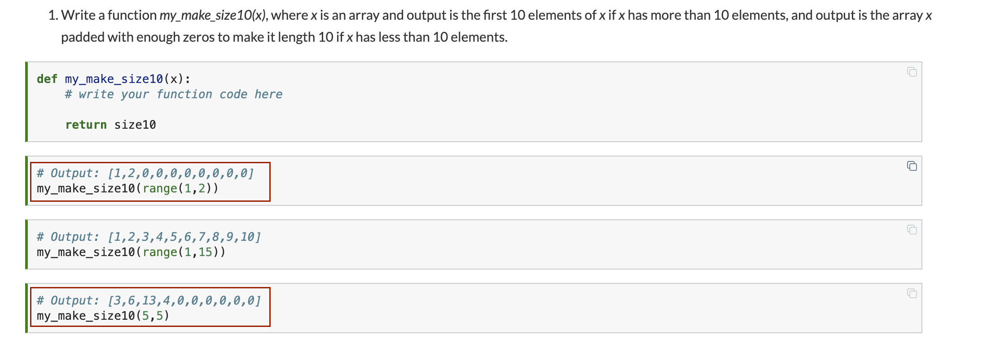

# Doubt 

I have some serious doubt in the Chapter 4 problem involving my_make_size10(x). I do not know how to take the input for 1 and 2 when it is using the range function. Also, how come the third cell for this statement is calling this (5, 5), when the function only takes 1 argument.
Posting the doubt with highlighted version

